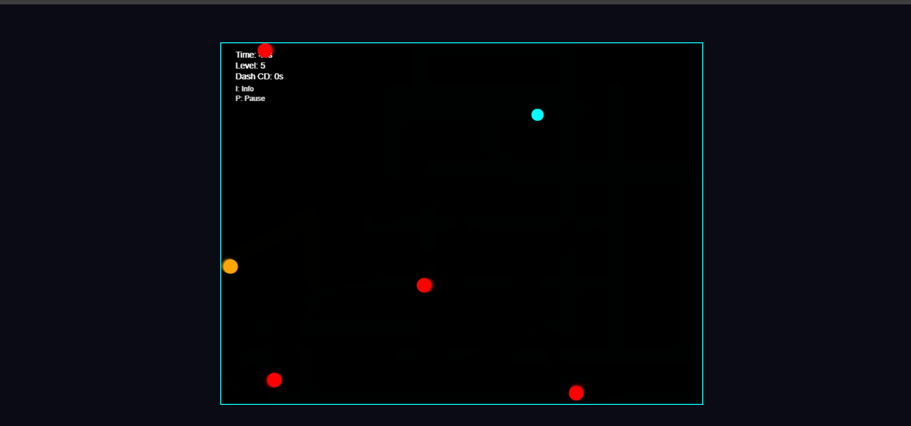

# 🎯 Neon Hunter

**Neon Hunter** is a fast-paced neon survival game built using **HTML5 Canvas and JavaScript**.  
Your goal is simple: **survive as long as you can**.

As time progresses, enemies become faster, smarter, and more aggressive — testing your reflexes, movement, and decision-making skills.

---

## 🚀 Live Demo
🔗 https://rd1241.github.io/Neon-Hunter/  
*(Update the link if needed)*

---

## 🕹️ How to Play

- Survive as long as possible
- Avoid enemy collisions
- Use dash wisely — it has a cooldown
- Difficulty increases every few seconds

---

## 🎮 Controls

| Key | Action |
|---|---|
| Arrow Keys | Move |
| Shift | Dash (with cooldown) |
| P | Pause / Resume |
| I | Toggle Game Info |
| Enter | Restart (after Game Over) |

---

## 👾 Enemy Types

| Color | Type | Behavior |
|---|---|---|
| 🔴 Red | Normal | Directly chases the player |
| 🟠 Orange | Fast | Moves faster and reacts quickly |
| 🟢 Green | Ambush | Predicts player movement (appears at higher levels) |

Enemies evolve as the difficulty level increases, making survival progressively harder.

---

## ⚙️ Game Features

- 🎯 **Progressive difficulty scaling**
- 🤖 **AI-based enemy behaviors**
- 💨 **Dash mechanic with cooldown**
- ⏸️ **Pause & Info game states**
- ✨ **Neon visual style**
- 🧠 **Predictive ambush logic**
- 🔁 **Safe restart system (no speed bugs)**

---

## 🧠 Technical Highlights

- HTML5 Canvas rendering
- `requestAnimationFrame` game loop
- Finite State Machine (PATROL / CHASE)
- Distance-based AI perception
- Predictive movement logic (ambush enemies)
- Proper time handling with pause support
- Clean game-state management

---

## 🛠️ Built With

- HTML5 Canvas
- Vanilla JavaScript
- CSS (Neon UI styling)

---

## 📌 Future Improvements

- Sound effects & background music
- Power-ups and abilities
- Scoreboard / high-score system
- Mobile controls
- AI-driven enemy learning (ML experiment)

---

## 👨‍💻 Author
**RAMAN DUGGAL**

**ID->RD1241**  
BCA (AI & ML) Student  
Aspiring **AI / ML Engineer & Game Developer**

---

⭐ If you like this project, consider starring the repository!

